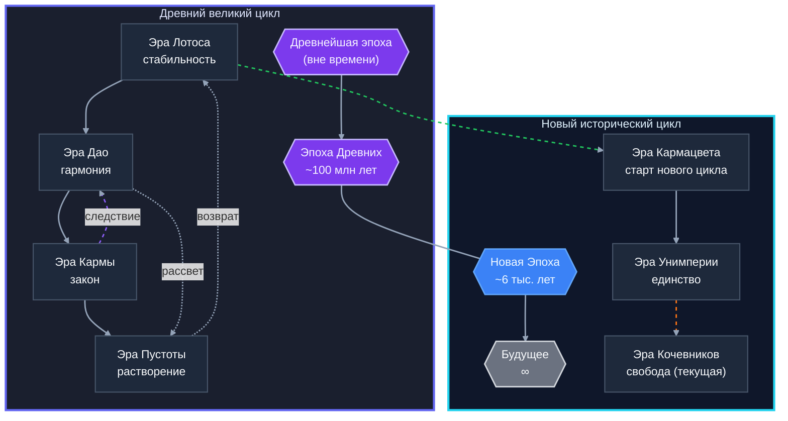

```mermaid
 flowchart TD

%% ===== ДРЕВНИЙ ЦИКЛ =====
subgraph Z1["Древний великий цикл"]
direction TB

A{{"Древнейшая эпоха<br>(вне времени)"}}
B{{"Эпоха Древних<br>~100 млн лет"}}

C["Эра Лотоса<br>стабильность"]
D["Эра Дао<br>гармония"]
E["Эра Кармы<br>закон"]
F["Эра Пустоты<br>растворение"]
end

%% ===== НОВЫЙ ЦИКЛ =====
subgraph Z2["Новый исторический цикл"]
direction TB

H{{"Новая Эпоха<br>~6 тыс. лет"}}
K{{"Будущее<br>∞"}}

G["Эра Кармацвета<br>старт нового цикла"]
I["Эра Унимперии<br>единство"]
J["Эра Кочевников<br>свобода (текущая)"]
end

%% ===== ОСНОВНОЕ ВРЕМЯ =====
A --> B
C --> D
D --> E
E --> F

%% ===== ВЫРАВНИВАНИЕ СПРАВА (ПАРАЛЛЕЛЬ) =====
B --- H
H --> K
G --> I
I --> J

%% ===== Переход из древнего цикла в новый =====
C --> G

%% ===== ЦИКЛ СОСТОЯНИЙ =====
E -.->|следствие| D
D -.->|рассвет| F
F -.->|возврат| C

%% ===== СТИЛИ ЗОН =====
style Z1 fill:#1a1f2e,stroke:#6366f1,stroke-width:3px,color:#e0e7ff
style Z2 fill:#0f172a,stroke:#22d3ee,stroke-width:3px,color:#e0f2fe

%% ===== СТИЛИ УЗЛОВ =====

classDef purpleEpoch fill:#7c3aed,stroke:#c4b5fd,stroke-width:2px,color:#f5f3ff
class A,B purpleEpoch

classDef blueEpoch fill:#3b82f6,stroke:#60a5fa,stroke-width:2px,color:#f0f9ff
class H blueEpoch

classDef grayEpoch fill:#6b7280,stroke:#d1d5db,stroke-width:2px,color:#f8fafc
class K grayEpoch

classDef era fill:#1e293b,stroke:#475569,color:#f8fafc,stroke-width:1.5px
class C,D,E,F,G,I,J era

%% ===== СТИЛИ СВЯЗЕЙ =====
linkStyle default stroke:#94a3b8,stroke-width:2px
linkStyle 7 stroke:#f97316,stroke-width:2px,stroke-dasharray:5 5
linkStyle 8 stroke:#22c55e,stroke-width:2px,stroke-dasharray:5 5
linkStyle 9 stroke:#8b5cf6,stroke-width:2px,stroke-dasharray:5 5
```
